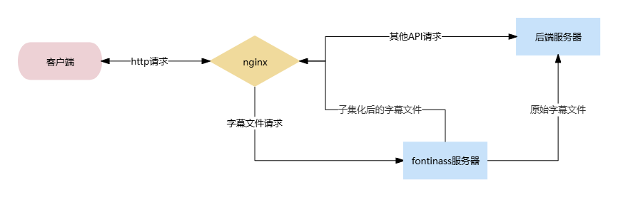

# FontInAss

实时将字体子集化后嵌入ass的小工具，用于在未安装对应字体的系统上正确显示字幕 

# 能做什么？

无需修改Emby/Jellyfin服务器与客户端，实现使用播放外挂ass/srt字幕时，在没有安装字体的设备上正确显示字幕。




# 快速开始

## Docker 部署

```
docker run -d --name=fontinass --restart=unless-stopped \
  -p 8012:8012 \
  -e EMBY_SERVER_URL=http://[ip]:[port] \
  -v /etc/fontinassData:/data \
  riderlty/fontinass:latest
```
设置EMBY_SERVER_URL为你的Emby/Jellyfin服务器的地址

如果你有本地字体，将字体目录映射到`/fonts`下即可被自动识别

```
  -v /path/to/your/fonts1:/fonts/dir1 \
  -v /path/to/your/fonts2:/fonts/dir2 \
  -v /path/to/your/fonts3:/fonts/dir3 \
```

> [!NOTE]
> 联网下载的字体存储在/fonts/download</br>即使无本地字体，也建议映射/fonts到主机路径，避免重复下载字体

在客户端上使用`http://[ip]:8012`访问容器代理后的服务器

### 无nginx版本
使用```riderlty/fontinass:nonginx```tag，不整合nginx，避免在使用302直链时套壳nginx

有需求的用户可参考手动部署，映射8011端口并配置字幕接口的nginx反向代理```location ~* /videos/(.*)/Subtitles```

## Unraid部署

下载模版
``` sh
curl -o /boot/config/plugins/dockerMan/templates-user/my-fontinass.xml  https://raw.githubusercontent.com/RiderLty/fontInAss/refs/heads/main/my-fontinass.xml
```
Docker > 添加容器 > 选择一个模版 > fontinass

修改环境变量并移除你不需要的配置项

应用
## 手动运行

安装依赖
```
pip install -r ./requirements.txt
```
编译c部分
```
cd src/py2cy
python setup.py build_ext --inplace
```
添加环境变量 EMBY_SERVER_URL ，例如：
```
EMBY_SERVER_URL = "http://192.168.3.3:7096"
```
添加nginx反向代理
```
server {
    listen 8012; #新的Emby访问端口
    
    location ~ /(socket|embywebsocket) {
        proxy_pass $EMBY_SERVER_URL;
        proxy_http_version 1.1;
        proxy_set_header Upgrade $http_upgrade;
        proxy_set_header Connection "upgrade";
        proxy_set_header Host $host;
        proxy_set_header X-Real-IP $remote_addr;
        proxy_set_header X-Forwarded-For $proxy_add_x_forwarded_for;
        proxy_set_header X-Forwarded-Proto $scheme;
        proxy_set_header X-Forwarded-Protocol $scheme;
        proxy_set_header X-Forwarded-Host $http_host;
    }

    location ~* /videos/(.*)/Subtitles {
        #修改为你的fontinass服务器地址
        proxy_pass http://127.0.0.1:8011;
    }

    location / {
        #修改为你的Emby/Jellyfin服务器地址
        proxy_pass $EMBY_SERVER_URL;
    }
}
```

## 关于客户端与播放器

内嵌字体的ASS并非所有播放器都支持，以下为部分播放器（客户端）的支持情况
| 名称  | 平台  | 支持ass内嵌字体  |
| ---   | --- | --- | 
| mpv   | windows/android |  ✅ |
| potplayer | windows |  ✅ |
| Emby for windows | windows |  ✅ |
| tsukimi | windows/linux | ✅ | 
| MX Player | android | ✅ |
| Exo Player | android | ❌ |
| hills | android | ✅ |
| yamby | android | ❌（Pro版本开启mpv播放器后支持） |
| Emby for Android | android | ❌ |
| Emby for Android TV | android | ❌ |  
| infuse | ios | ✅ |
| SenPlayer | ios | ✅ |
| vidhub | ios | ✅ |
| Emby for ios | ios | ✅ | 

欢迎补充

## 其他配置说明

容器内部端口`8011`为字体处理服务

`8012`为nginx反向代理端口，使用此端口访问代理后的服务器

如有其他需求，可暴露`8011`端口用于字幕处理

添加环境变量SRT_2_ASS_FORMAT与SRT_2_ASS_STYLE，可实现SRT转ASS，统一在不同设备上的播放效果（Jellyfin无法使用）
```
  -e SRT_2_ASS_FORMAT='Format: Name, Fontname, Fontsize, PrimaryColour, SecondaryColour, OutlineColour, BackColour, Bold, Italic, Underline, StrikeOut, ScaleX, ScaleY, Spacing, Angle, BorderStyle, Outline, Shadow, Alignment, MarginL, MarginR, MarginV, Encoding'
  -e SRT_2_ASS_STYLE='Style: Default,楷体,20,&H03FFFFFF,&H00FFFFFF,&H00000000,&H02000000,-1,0,0,0,100,100,0,0,1,2,0,2,10,10,10,1'
```

字幕缓存上限，默认50，单位（条）
```
-e SUB_CACHE_SIZE=50
```

字幕缓存在内存的过期时间，默认60，单位（分钟），SUB_CACHE_TTL <= 0 禁用过期
```
-e SUB_CACHE_TTL=60
```

字体缓存上限，默认30，单位（条）
```
-e FONT_CACHE_SIZE=30
```

字体缓存在内存的过期时间，默认30，单位（分钟），FONT_CACHE_TTL <= 0 禁用过期
```
-e FONT_CACHE_TTL=30
```

支持[HDR适配](https://github.com/yyymeow/ssaHdrify)，避免亮度过高

也可通过```http://[ip]:8011/setHDR```临时调整(需开放8011端口)

通过HDR来设置字幕亮度峰值, 例如1000nit，默认-1 不开启
```
-e HDR=1000
```

日志等级，可设置为 DEBUG INFO WARNING ERROR CRITICAL
```
-e LOG_LEVEL=DEBUG
```

错误信息显示，默认关闭，单位（秒）范围大于0小于60，

开启后会在字幕开头插入错误信息用来告知字体缺失或者其他错误信息
```
-e ERROR_DISPLAY=3.5
```

# 原理说明

## 字体子集化

对字体文件进行处理，仅保留字幕文件用到了的字体，从而缩小字体体积

## 字体嵌入ass
使用UUEncode对子集化后的字体二进制文件进行编码，在ass内添加[Fonts]标签，将编码后字体嵌入字幕（不保证兼容性，部分播放器可能不支持）

## nginx

拦截/videos/(.*)/Subtitles请求，将内容发送到程序处理后，替换原本的内容返回给客户端

# 其他说明

自带的 [onlineFonts.json](https://github.com/RiderLty/fontInAss/blob/main/onlineFonts.json) 文件来自[超级字体整合包 XZ](https://vcb-s.com/archives/1114)
